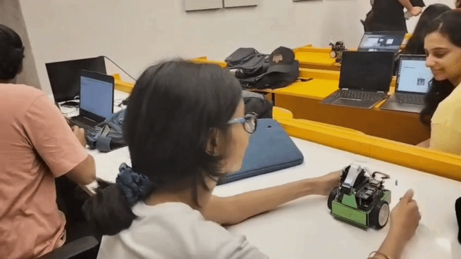
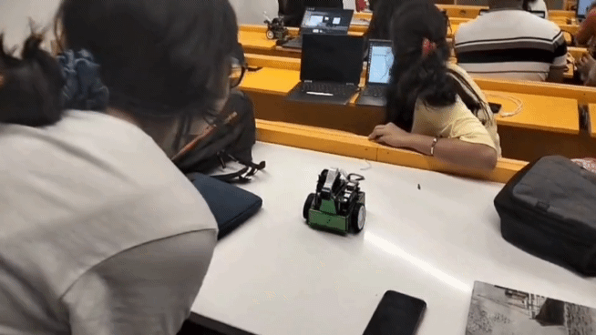

##  Download Pretrained Models

-  [best_model.pth (Google Drive)](https://drive.google.com/file/d/1Wa7SZmTXA2rsKm1J5NnokT8BvO1u3eBj/view?usp=sharing)
-  [best_model2.pth (Google Drive)](https://drive.google.com/file/d/1CD6_rYji3KtF5Xu3MV4JUfSD0HZDtJIc/view?usp=sharing)

# Demo
1. Detects happy
   <br>
   <br>

<br>
<br>

2. Detects angry
   <br>
   <br>


--------------------------------

# Setup
## Step 1: Clone and Configure the JetBot Repository

```bash
# Clone the JetBot repo
git clone https://github.com/NVIDIA-AI-IOT/jetbot.git

# Navigate into the repo
cd jetbot

# Run the Jetson configuration script
./scripts/configure_jetson.sh
```
## Step 2: Configure and Build Docker Containers

```bash
# Move into the docker directory
cd docker

# Edit the configure.sh file and replace the jetbot image version with what you are using

# Apply the Docker runtime configuration
source configure.sh

# Set the NVIDIA runtime as default
./set_nvidia_runtime.sh

# Make any required changes in the Dockerfile (provided in repo for reference) and run
./build.sh
```

## Step 3: Enable Docker on Boot & Set Working Directory

```bash
# Enable Docker service to start on boot
sudo systemctl enable docker

# Enable JetBot and set the working directory (can be $HOME or any path you prefer)
./enable.sh $HOME
```

## Step 4: Connect to wifi

```bash
sudo nmcli device wifi connect <MY_WIFI_AP> password <MY_WIFI_PASSWORD>
```

## Step 5: Access JetBot from Your Browser

```bash
# Get the JetBot’s IP address:
ifconfig

# On your laptop browser, open:
https://<jetbot_ip>:8888
```

#### You should now be able to access the Jetbot jupyter noteboooks from your browser

<br>

--------

<br>


# Project: Emotion-Based Autonomous Control
We trained a **ResNet-based CNN** to classify emotions from real-time camera input.  
The JetBot currently responds to **two emotions**:

- **Happy 😊** → Jetbot moves in a **circle**
- **Angry 😠** → Jetbot **moves away**

This creates a basic form of **emotion-aware interaction** between human and robot.
 

## Step 1: 


